# SkillHill - Online Oktatási Platform Dokumentáció

<style>
body {
    margin: 2cm;
}
</style>

## Tartalomjegyzék

1. [Bevezetés](#1-bevezetés)
   - 1.1. [A Projekt Célja](#11-a-projekt-célja)
   - 1.2. [Főbb Funkciók](#12-főbb-funkciók)
   - 1.3. [Technológiai Stack](#13-technológiai-stack)

2. [Rendszerarchitektúra](#2-rendszerarchitektúra)
   - 2.1. [Magas Szintű Architektúra](#21-magas-szintű-architektúra)
   - 2.2. [Komponensek](#22-komponensek)
   - 2.3. [Adatbázis Séma](#23-adatbázis-séma)

3. [Frontend Architektúra](#3-frontend-architektúra)
   - 3.1. [Komponens Hierarchia](#31-komponens-hierarchia)
   - 3.2. [Állapotkezelés](#32-állapotkezelés)
   - 3.3. [Routing](#33-routing)
   - 3.4. [UI/UX Design](#34-uiux-design)

4. [Backend Architektúra](#4-backend-architektúra)
   - 4.1. [API Réteg](#41-api-réteg)
   - 4.2. [Szolgáltatások](#42-szolgáltatások)
   - 4.3. [Adatbázis Kapcsolat](#43-adatbázis-kapcsolat)
   - 4.4. [Fájlkezelés](#44-fájlkezelés)

5. [Biztonság](#5-biztonság)
   - 5.1. [Autentikáció](#51-autentikáció)
   - 5.2. [Jogosultságkezelés (RBAC)](#52-jogosultságkezelés-rbac)

6. [Tesztelés](#6-tesztelés)
   - 6.1. [Egység Tesztek](#61-egység-tesztek)
   - 6.2. [Manuális Tesztek](#62-manuális-tesztek)

7. [Deployment](#7-deployment)
   - 7.1. [Környezetek](#71-környezetek)
   - 7.1.1. [Fejlesztői környezet](#711-fejlesztői-környezet-development)
   - 7.1.2. [Tesztlési környezet](#712-tesztelési-környezet)
   - 7.1.3. [Staging környezet](#713-előkészítő-környezet-staging)
   - 7.1.4. [Produkciós környezet](#714-produkciós-környezet-production)
   - 7.2. [CI/CD Pipeline](#72-cicd-pipeline)
      - 7.2.1. [Kód commit és push](#721-kód-commit-és-push)
      - 7.2.2. [Code review](#722-pull-request-és-code-review)
      - 7.2.3. [Build generálás](#723-build-és-artifact-generálás)
      - 7.2.4. [Deployment a testing környezetbe](#724-deployment-a-testing-környezetbe)
      - 7.2.5. [Deployment a staging környezetbe](#725-deployment-a-staging-környezetbe)
      - 7.2.6. [Monitoring és validáció](#726-monitoring-és-validáció)
      - 7.2.7. [IaC](#727-infrastructure-as-code-iac)
        - 7.2.7.1. [Docker konfigurációk](#7271-docker-konfigurációk)
      - 7.2.8. [Tesztelési stratégia](#728-tesztelési-stratégia)
      - 7.2.9. [Rollback stratégia](#729-rollback-stratégia)
        - 7.2.9.1. [Adatbázis migrációk kezelése](#7291-adatbázis-migrációk-kezelése)
   - 7.3. [Monitoring](#73-monitoring)
   - 7.4. [Hibaelhárítás](#74-hibaelhárítás)

8. [API Dokumentáció](#8-api-dokumentáció)
   - 8.1. [Autentikációs Végpontok](#81-autentikációs-végpontok)
   - 8.2. [Kurzus Végpontok](#82-kurzus-végpontok)
   - 8.3. [Felhasználói Végpontok](#83-felhasználói-végpontok)
   - 8.4. [Fájl Végpontok](#84-fájl-végpontok)

9. [Felhasználói Dokumentáció](#9-felhasználói-dokumentáció)
   - 9.1. [Telepítési Útmutató](#91-telepítési-útmutató)
   - 9.2. [Konfigurációs Beállítások](#92-konfigurációs-beállítások)
   - 9.3. [Hibaelhárítási Útmutató](#93-hibaelhárítási-útmutató)

10. [Fejlesztői Dokumentáció](#10-fejlesztői-dokumentáció)
    - 10.1. [Fejlesztői Környezet Beállítása](#101-fejlesztői-környezet-beállítása)
    - 10.2. [Kódolási Konvenciók](#102-kódolási-konvenciók)
    - 10.3. [Verziókezelési Stratégia](#103-verziókezelési-stratégia)

11. [Jövőbeli Tervek](#11-jövőbeli-tervek)
    - 11.1. [AI Segítő Rendszer](#111-ai-segítő-rendszer)
    - 11.2. [Pontrendszer és Versenyek](#112-pontrendszer-és-versenyek)
    - 11.3. [Chat Alkalmazás](#113-chat-alkalmazás)
    - 11.4. [Képernyő Megosztás és Whiteboard](#114-képernyő-megosztás-és-whiteboard)
    - 11.5. [Implementációs Terv](#115-implementációs-terv)

## 1. Bevezetés

### 1.1. A Projekt Célja

A SkillHill egy modern, felhasználóbarát online oktatási platform, amely lehetővé teszi oktatók és tanulók számára a hatékony tudásmegosztást és -elsajátítást. A platform célja, hogy:

- Egyszerű és intuitív felületet biztosítson az online oktatáshoz
  - A felhasználói felület letisztult és könnyen átlátható, minimalizálva a tanulási görbét
  - A navigáció logikusan felépített, a főbb funkciók egy-két kattintással elérhetőek
  - A reszponzív dizájn biztosítja, hogy minden eszközön (számítógép, tablet, telefon) optimálisan használható legyen
  - A felhasználói visszajelzések alapján folyamatosan finomítjuk a felület használhatóságát

- Támogassa a különböző típusú oktatási anyagok kezelését
  - A rendszer képes kezelni videó tartalmakat, dokumentumokat (PDF, DOC, PPT), képeket és interaktív anyagokat
  - A feltöltött tartalmak automatikusan kategorizálhatók és rendszerezhetők
  - A tananyagok modulokba szervezhetők, ami segíti a strukturált oktatást
  - Beépített előnézeti funkció segíti a tartalmak gyors áttekintését
  - A tartalmak verziókezelése biztosítja a tananyagok naprakészen tartását

- Lehetővé tegye a tanulási folyamat nyomon követését
  - A tanárok valós időben követhetik a diákok előrehaladását
  - Részletes statisztikák és jelentések segítik az oktatási folyamat elemzését
  - A rendszer automatikusan naplózza a tanulói aktivitást és teljesítményt
  - Személyre szabott visszajelzések és értékelések készíthetők
  - A diákok is láthatják saját haladásukat és teljesítményüket

- Rugalmas és skálázható megoldást nyújtson az online oktatás kihívásaira
  - A moduláris felépítés lehetővé teszi új funkciók egyszerű integrálását
  - A rendszer képes nagy mennyiségű felhasználó és tartalom kezelésére
  - A felhő alapú infrastruktúra biztosítja a folyamatos elérhetőséget
  - Automatikus biztonsági mentések védik az adatokat
  - A rendszer könnyen bővíthető új oktatási módszerek és technológiák támogatásával

- Biztonságos és megbízható működést biztosítson
  - Többszintű jogosultságkezelés védi a tartalmakat és az adatokat
  - A rendszeres biztonsági auditok garantálják a biztonságos működést
  - A felhasználói adatok titkosítva tárolódnak
  - A rendszer megfelel az adatvédelmi előírásoknak (GDPR)
  - Részletes naplózás segíti az esetleges problémák felderítését


### 1.2. Főbb Funkciók

A SkillHill platform az alábbi kulcsfontosságú funkciókat biztosítja:

#### Kurzuskezelés
- Kurzusok létrehozása és szerkesztése
- Modulok és leckék strukturált kezelése
- Különböző típusú tananyagok feltöltése és rendszerezése

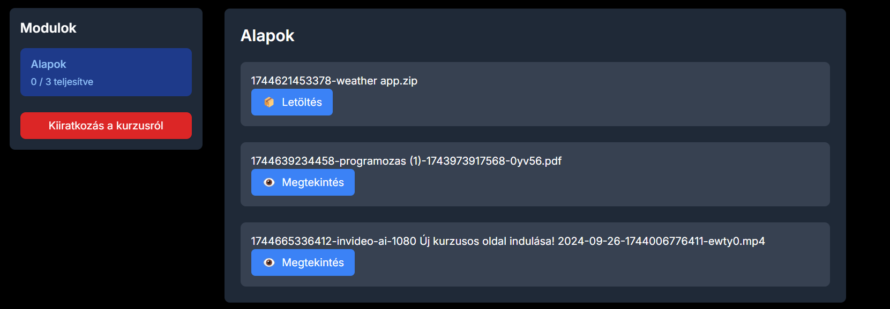

#### Felhasználói Felületek
- Személyre szabott irányítópult oktatóknak és tanulóknak
- Intuitív navigáció és keresés
- Reszponzív dizájn minden eszközön

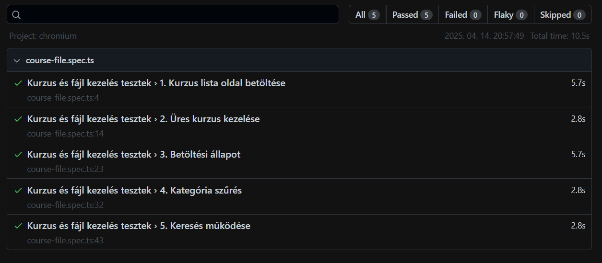

#### Tanulási Élmény
- Interaktív tananyag megjelenítés
- Haladás követése és jelentések

### 1.3. Technológiai Stack

A SkillHill platform a következő modern technológiákat használja:

#### Frontend
- Next.js 13 (App Router)
- TypeScript
- Tailwind CSS
- Shadcn/ui, Radix UI komponensek
- React Query

#### Backend
- Node.js
- Next.js
- NextAuth.js
- MySql
- Prisma ORM

#### Infrastruktúra
- Docker

## 2. Rendszerarchitektúra

### 2.1. Oldal Struktúra és Navigáció

Az alkalmazás oldalai a következőképpen épülnek fel:

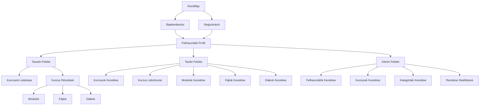

#### Magyarázat a Routing Diagramhoz

1. **Kezdőpontok**:
   - **Kezdőlap**: Az alkalmazás belépési pontja
   - **Bejelentkezés/Regisztráció**: Felhasználói azonosítás és fiók létrehozás

2. **Felhasználói Profil**:
   - Központi pont a felhasználói felületek között
   - Innen érhetőek el a különböző jogosultsági szintekhez tartozó funkciók

3. **Tanulói Felület**:
   - **Kurzusok Listázása**: Elérhető és felvett kurzusok megtekintése
   - **Kurzus Részletek**: 
     - Modulok megtekintése
     - Fájlok elérése és letöltése
     - Diákok listázása

4. **Tanári Felület**:
   - **Kurzusok Kezelése**: Kurzusok létrehozása, szerkesztése, törlése
   - **Modulok Kezelése**: Modulok létrehozása és szerkesztése
   - **Fájlok Kezelése**: Tananyagok feltöltése és kezelése
   - **Diákok Kezelése**: Diákok felvétele és kezelése

5. **Admin Felület**:
   - **Felhasználók Kezelése**: Felhasználói fiókok kezelése
   - **Kurzusok Kezelése**: Rendszerszintű kurzuskezelés
   - **Kategóriák Kezelése**: Kurzus kategóriák kezelése
   - **Rendszer Beállítások**: Alkalmazás beállításainak kezelése

A diagram a következő fontos jellemzőket mutatja:
- Hierarchikus struktúra a felhasználói jogosultságok alapján
- Egyértelmű navigációs útvonalak
- Logikus csoportosítás a funkciók szerint
- Kétirányú kapcsolatok a kapcsolódó oldalak között

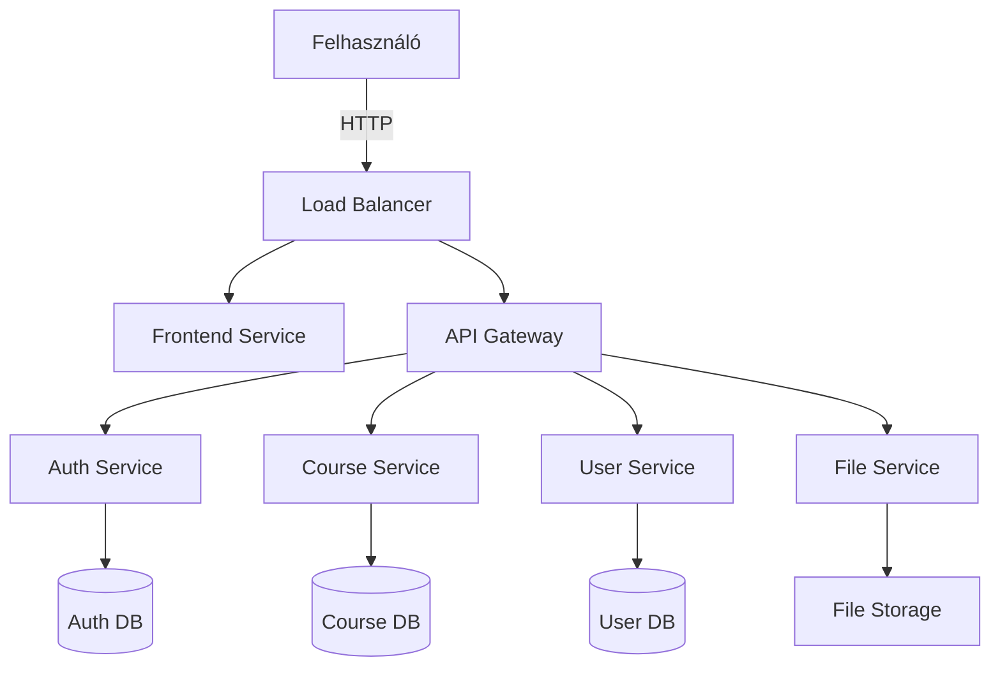

#### Magyarázat a Rendszerarchitektúra Diagramhoz

A SkillHill platform egy modern, mikroszolgáltatás-alapú architektúrát követ, amely a következő főbb komponensekből áll:

1. **Felhasználói Réteg**:
   - A felhasználók HTTP protokollon keresztül érik el a rendszert
   - A Load Balancer biztosítja a terheléselosztást és a magas rendelkezésre állást

2. **Frontend Réteg**:
   - **Frontend Service**: Next.js alapú kiszolgáló, amely kezeli a felhasználói felületet
   - Dinamikus oldalgenerálás és kliensoldali interakciók kezelése

3. **API Réteg**:
   - **API Gateway**: Központi belépési pont az összes szolgáltatás számára
   - Kérés-útválasztás és hitelesítés kezelése
   - Rate limiting és biztonsági szabályok alkalmazása

4. **Szolgáltatási Réteg**:
   - **Auth Service**: Felhasználói hitelesítés és jogosultságkezelés
   - **Course Service**: Kurzusok és modulok kezelése
   - **User Service**: Felhasználói profilok és beállítások kezelése
   - **File Service**: Fájlok tárolása és kezelése

5. **Adatbázis Réteg**:
   - **Auth DB**: Felhasználói hitelesítési adatok tárolása
   - **Course DB**: Kurzusok és modulok adatainak tárolása
   - **User DB**: Felhasználói profilok és beállítások tárolása
   - **File Storage**: Fájlok tárolása és kezelése

A rendszer a következő előnyöket biztosítja:
- **Skálázhatóság**: Minden szolgáltatás függetlenül skálázható
- **Rugalmasság**: Új szolgáltatások könnyen integrálhatók
- **Megbízhatóság**: Többszörös redundancia és terheléselosztás
- **Biztonság**: Központosított hitelesítés és jogosultságkezelés
- **Teljesítmény**: Optimalizált adatbázis-hozzáférés és gyorsítótárazás

A mikroszolgáltatás-architektúra lehetővé teszi:
- Független fejlesztést és üzembe helyezést
- Különböző technológiák használatát
- Egyszerű karbantarthatóságot
- Rugalmas skálázhatóságot

### 2.2. Komponensek

#### Frontend Szolgáltatás
- Next.js alapú SSR alkalmazás
- Központi állapotkezelés
- Komponens alapú felépítés
- Optimalizált asset kezelés

#### API Gateway
- Központi belépési pont
- Kérések validálása és irányítása
- Rate limiting és caching
- API dokumentáció (Swagger)

#### Autentikációs Szolgáltatás
- Session kezelés
- OAuth2 integráció
- Session menedzsment
- Biztonságos jelszókezelés

#### Kurzus Szolgáltatás
- Kurzus életciklus kezelés
- Tananyag szervezés

### 2.3. Adatbázis Séma

A rendszer MySQL adatbázist használ, Prisma ORM-mel. Az alábbiakban a főbb entitások és kapcsolataik láthatók:

```prisma
model User {
  id            String          @id @default(cuid())
  name          String?
  username      String?         @unique
  email         String          @unique
  emailVerified DateTime?
  image         Int?
  roleId        Int             @default(2)
  isSubscribed  Boolean         @default(false)
  accounts      Account[]
  sessions      Session[]
  submissions   Submission[]
  enrollments   Enrollment[]
  courses       Course[]
  createdAt     DateTime        @default(now())
  updatedAt     DateTime        @updatedAt
  role          Roles           @relation(fields: [roleId], references: [id])

  @@map("Users")
}

model Roles {
  id        Int      @id @default(autoincrement())          
  role_name String   @unique
  users     User[]
}

model Course {
  id          Int               @id @default(autoincrement()) @map("course_id")
  name        String           @map("course_name")
  description String
  createdAt   DateTime         @default(now()) @map("created_at")
  categoryId  Int              @map("category_id")
  email       String
  isActive    Boolean          @default(false) @map("is_active")
  category    Category         @relation(fields: [categoryId], references: [id], onDelete: Cascade)
  user        User             @relation(fields: [email], references: [email], onDelete: Cascade)
  materials   CourseMaterial[]
  enrollments Enrollment[]
  assignments Assignment[]
  submissions Submission[]
  modules     CourseModule[]

  @@map("courses")
}

model Category {
  id      Int      @id @default(autoincrement()) @map("category_id")
  name    String   @map("category_name")
  courses Course[]

  @@map("categories")
}

model CourseMaterial {
  id        Int           @id @default(autoincrement()) @map("material_id")
  courseId  Int
  moduleId  Int?
  course    Course        @relation(fields: [courseId], references: [id])
  module    CourseModule? @relation(fields: [moduleId], references: [id])
  files     File[]

  @@map("course_materials")
}

model File {
  id              Int             @id @default(autoincrement()) @map("file_id")
  name            String          @map("file_name")
  materialId      Int?            @map("coursematerialId")
  submissionId    String?
  assignmentId    String?
  courseMaterial  CourseMaterial? @relation(fields: [materialId], references: [id])
  submission      Submission?     @relation(fields: [submissionId], references: [id])
  assignment      Assignment?     @relation(fields: [assignmentId], references: [id])
  moduleResources ModuleResource[]

  @@map("files")
}

model Enrollment {
  id         Int      @id @default(autoincrement()) @map("enrollment_id")
  email      String
  enrolledAt DateTime @default(now()) @map("enrolment_date")
  courseId   Int      @map("course_id")
  course     Course   @relation(fields: [courseId], references: [id])
  user       User     @relation(fields: [email], references: [email], onDelete: Cascade)

  @@map("enrollment")
}

model Assignment {
  id          String    @id @default(cuid()) @map("assignment_id")
  courseId    Int       @map("course_id")
  title       String
  description String
  createdAt   DateTime  @default(now()) @map("created_at")
  course      Course    @relation(fields: [courseId], references: [id], onDelete: Cascade)
  files       File[]

  @@map("assignments")
}

model Submission {
  id          String    @id @default(cuid()) @map("submission_id")
  courseId    Int       @map("course_id")
  userId      String    @map("user_id")
  submittedAt DateTime  @default(now()) @map("submission_date")
  user        User      @relation(fields: [userId], references: [id], onDelete: Cascade)
  course      Course    @relation(fields: [courseId], references: [id], onDelete: Cascade)
  files       File[]

  @@map("submissions")
}

model CourseModule {
  id          Int      @id @default(autoincrement()) @map("module_id")
  courseId    Int      @map("course_id")
  name        String   @map("module_name")
  description String
  course      Course   @relation(fields: [courseId], references: [id], onDelete: Cascade)
  materials   CourseMaterial[]
  resources   ModuleResource[]

  @@map("course_modules")
}

model ModuleResource {
  id        Int      @id @default(autoincrement()) @map("resource_id")
  moduleId  Int      @map("module_id")
  fileId    Int      @map("file_id")
  module    CourseModule @relation(fields: [moduleId], references: [id], onDelete: Cascade)
  file      File     @relation(fields: [fileId], references: [id], onDelete: Cascade)

  @@map("module_resources")
}
```

A fenti ábra bemutat néhány alapvető Prisma kódot, a modellekkel kapcsolatban. Egy model egy táblát takar az adatbázisan, a kapcsos zárójelek között a mezőnevek és azoknak a típusai lelhetők fel. Ha egy típus tömb értékű, például a Course táblában a modules mező az azt jelenti, hogy ahhoz a tulajdonsághoz több érték is tartozhat.


Az ábra az adatbázis ER-diagrammját ábrázolja.
Egy felhasználó az oldalra való regisztráció után automatikusan user rangot kap. Későbbiekben kifejtésre kerülnek a jogkörök hatáskörei az oldalon.
Az ábrán láthatóak a táblák közötti kapcsolatok.

## 3. Frontend Architektúra

### 3.1. Komponens Hierarchia

A frontend alkalmazás komponens alapú architektúrát követ, ahol minden komponens egy jól definiált feladatot lát el:

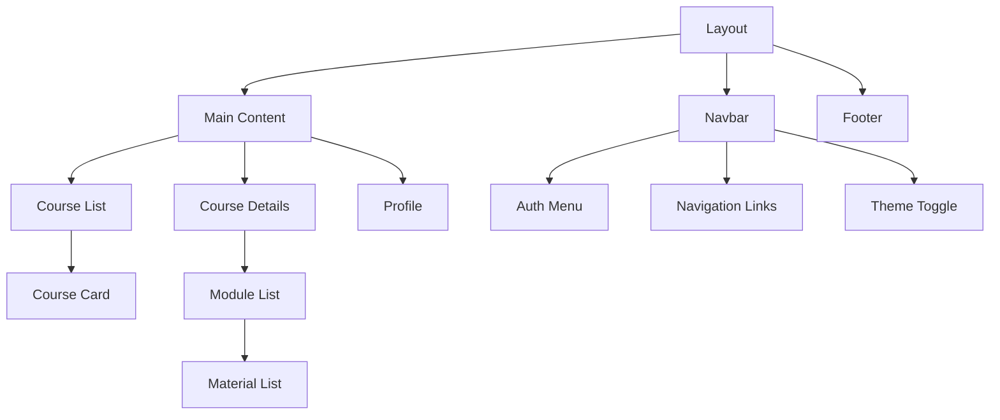


### 3.2. Állapotkezelés

Az alkalmazás állapotkezelése több rétegben történik:

#### Szerver Oldali Állapot
```typescript
// Példa React Query használatára
export function useCourses() {
  return useQuery({
    queryKey: ['courses'],
    queryFn: async () => {
      const response = await fetch('/api/courses');
      if (!response.ok) {
        throw new Error('Network response was not ok');
      }
      return response.json();
    },
  });
}
```

#### Kliens Oldali Állapot
```typescript
// Példa Zustand store használatára
interface ThemeStore {
  theme: 'light' | 'dark';
  toggleTheme: () => void;
}

export const useThemeStore = create<ThemeStore>((set) => ({
  theme: 'light',
  toggleTheme: () => set((state) => ({ 
    theme: state.theme === 'light' ? 'dark' : 'light' 
  })),
}));
```

### 3.3. Routing

A Next.js 13 App Router használatával az alkalmazás routing struktúrája közvetlenül a fájlrendszerből származik:

```typescript
// app/courses/[id]/page.tsx
export default async function CoursePage({ params }: { params: { id: string } }) {
  const course = await getCourse(params.id);
  
  return (
    <div>
      <h1>{course.title}</h1>
      <CourseContent course={course} />
    </div>
  );
}
```

### 3.4. UI/UX Design

A felhasználói felület tervezése során a következő alapelveket követtük:

#### Design System
- Konzisztens színpaletta és tipográfia
- Újrafelhasználható komponensek
- Reszponzív layout rendszer
- Akadálymentesítési megfontolások

```typescript
// Példa egy újrafelhasználható gomb komponensre
export const Button = React.forwardRef<
  HTMLButtonElement,
  ButtonProps
>(({ className, variant, size, ...props }, ref) => {
  return (
    <button
      className={cn(
        buttonVariants({ variant, size, className })
      )}
      ref={ref}
      {...props}
    />
  );
});
Button.displayName = "Button";
```
A kód egy újrafelhasználható gomb komponenst mutat be, amely a React forwardRef funkcióját használja. A komponens három fő tulajdonsággal rendelkezik: className a CSS osztályok hozzáadásához, variant a gomb stílusának megváltoztatásához, és size a gomb méretének beállításához. A cn függvény segítségével kombinálja ezeket a tulajdonságokat, majd a buttonVariants függvény segítségével generálja a megfelelő CSS osztályokat. A displayName tulajdonság beállítása segít a fejlesztői eszközökben a komponens azonosításában. Ez a megközelítés lehetővé teszi a konzisztens gomb stílusok használatát az egész alkalmazásban, miközben rugalmasságot biztosít a különböző használati esetekhez.


## 4. Backend Architektúra

### 4.1. API Réteg

A backend API-k Next.js API Routes-on keresztül valósulnak meg:

```typescript
// Példa a kurzus API végpontról
import { NextApiRequest, NextApiResponse } from 'next';
import { getServerSession } from 'next-auth';
import { authOptions } from '@/lib/auth';
import { prisma } from '@/lib/prisma';

export const GET = auth(async function GET(req: { auth: any; }){
    if (!req.auth) {
        return NextResponse.json({ error: 'Nem vagy bejelentkezve' }, { status: 401 });
    }
    
    try{
        const courses = await prisma.course.findMany({
            select: {
                id: true,
                name: true,
                description: true
            }
        });
        return NextResponse.json(courses, {status: 200});
    }catch{
        console.error('Hiba a csatlakozás során!');
        return NextResponse.json({error: 'Hiba a csatlakozás során!'}, {status: 500});
    }  
});
```

### 4.2. Szolgáltatások

A backend szolgáltatások moduláris felépítésűek:

```typescript
import { NextApiRequest, NextApiResponse } from 'next';
import { getServerSession } from 'next-auth';
import { authOptions } from '@/lib/auth';
import { prisma } from '@/lib/prisma';

export const GET = auth(async function GET(req: { auth: any; params: { id: string } }){
    if (!req.auth) {
        return NextResponse.json({ error: 'Nem vagy bejelentkezve' }, { status: 401 });
    }
    
    const courseId = req.params.id;

    try {
        const course = await prisma.course.findUnique({
            where: { id: courseId },
            include: {
                modules: true,
                materials: true
            }
        });

        if (!course) {
            return NextResponse.json({ error: 'Kurzus nem található' }, { status: 404 });
        }

        return NextResponse.json(course, { status: 200 });
    } catch (error) {
        console.error('Hiba a kurzus adatok lekérése során:', error);
        return NextResponse.json({ error: 'Hiba a kurzus adatok lekérése során' }, { status: 500 });
    }
});
```

A példakód jól szemlélteti a backend moduláris felépítésének előnyeit:

1. **Függőségek Kezelése:**
   - A kód elején látható importok (`import { NextApiRequest, NextApiResponse }`) mutatják, hogy minden modul csak a szükséges függőségeket importálja
   - A `@/lib/auth` és `@/lib/prisma` modulok külön vannak szervezve, így könnyen kicserélhetők vagy frissíthetők

2. **Funkcionális Elkülönítés:**
   - A `GET` függvény egy jól definiált feladatot lát el: kurzus adatainak lekérdezését
   - A hibakezelés és az autentikáció elkülönül a fő logikától
   - A Prisma ORM használata az adatbázis műveletek elkülönítését mutatja

3. **Kód Újrafelhasználhatóság:**
   - Az `auth` middleware újrafelhasználható más végpontokon is
   - A hibakezelés mintázata konzisztens és újrafelhasználható
   - A Prisma modell definíciók közösen használhatók

4. **Könnyű Karbantarthatóság:**
   - A kód jól strukturált és könnyen olvasható
   - A hibakezelés és a validáció egyértelműen elkülönül
   - A függőségek explicit módon vannak deklarálva

5. **Tesztelhetőség:**
   - A moduláris felépítés lehetővé teszi az egységtesztek írását
   - A függőségek könnyen mockolhatók
   - A hibakezelés tesztelhető különállóan

6. **Skálázhatóság:**
   - A modulok függetlenül fejleszthetők és telepíthetők
   - A terhelés optimalizálható modulonként
   - Új funkciók könnyen integrálhatók

7. **Biztonság:**
   - Az autentikáció központilag kezelhető
   - A jogosultságkezelés modulonként finomhangolható
   - A hibakezelés konzisztens és biztonságos

### 4.3. Adatbázis Kapcsolat

Az adatbázis kapcsolatot Prisma ORM kezeli:

```prisma
// Példa a Prisma sémáról
model User {
  id        String   @id @default(cuid())
  email     String   @unique
  name      String?
  role      Role     @default(user)
  courses   Course[]
  createdAt DateTime @default(now())
  updatedAt DateTime @updatedAt
}

model Course {
  id          String   @id @default(cuid())
  title       String
  description String?
  email       String
  email       User     @relation(fields: [email], references: [email])
  modules     Module[]
  createdAt   DateTime @default(now())
  updatedAt   DateTime @updatedAt
}

model Module {
  id          String     @id @default(cuid())
  title       String
  courseId    String
  course      Course     @relation(fields: [courseId], references: [id])
  materials   Material[]
  order       Int
  createdAt   DateTime   @default(now())
  updatedAt   DateTime   @updatedAt
}

model Material {
  id        String   @id @default(cuid())
  title     String
  type      String
  content   String?
  fileUrl   String?
  moduleId  String
  module    Module   @relation(fields: [moduleId], references: [id])
  order     Int
  createdAt DateTime @default(now())
  updatedAt DateTime @updatedAt
}
```

A fenti ábra bemutat néhány alapvető Prisma kódot, a modellekkel kapcsolatban. Egy model egy táblát takar az adatbázisan, a kapcsos zárójelek között a mezőnevek és azoknak a típusai lelhetők fel. Ha egy típus tömb értékű, például a Course táblában a modules mező az azt jelenti, hogy ahhoz a tulajdonsághoz több érték is tartozhat.


Az ábra az adatbázis ER-diagrammját ábrázolja.
Egy felhasználó az oldalra való regisztráció után automatikusan user rangot kap. Későbbiekben kifejtésre kerülnek a jogkörök hatáskörei az oldalon.
Az ábrán láthatóak a táblák közötti kapcsolatok.

### 4.4. Fájlkezelés

A fájlkezelés a következőképpen valósul meg:

```typescript
// Példa a fájl feltöltés implementációjára
export async function POST(
    request: NextRequest,
    { params }: { params: { id: string } }
) {
    try {
        // 1. Autentikáció ellenőrzése
        const session = await auth();
        if (!session || !session.user) {
            return NextResponse.json({ error: 'Nincs bejelentkezve' }, { status: 401 });
        }

        // 2. Kurzus azonosító és jogosultság ellenőrzése
        const courseId = parseInt(params.id);
        const validation = await validateTeacherAccess(session.user.id as string, courseId);
        
        // 3. Form adatok kinyerése
        const formData = await request.formData();
        const file = formData.get('file') as File;
        const name = formData.get('name') as string;
        const moduleId = formData.get('module_id') as string;
        
        // 4. Fájl típus és név meghatározása
        const fileType = getFileType(file.name);
        const fileName = `${Date.now()}-${file.name}`;
        
        // 5. Fájl mentése a public/uploads mappába
        const uploadsPath = path.join(process.cwd(), 'public', 'uploads', fileName);
        await writeFile(uploadsPath, Buffer.from(await file.arrayBuffer()));
        
        // 6. Fájl mentése a course_materials mappába
        const courseMaterialsPath = path.join(process.cwd(), 'public', 'course_materials', courseId.toString(), fileName);
        const courseMaterialsDir = path.dirname(courseMaterialsPath);
        
        if (!fs.existsSync(courseMaterialsDir)) {
            fs.mkdirSync(courseMaterialsDir, { recursive: true });
        }
        
        await writeFile(courseMaterialsPath, Buffer.from(await file.arrayBuffer()));
        
        // 7. Fájl rekord létrehozása az adatbázisban
        const fileRecord = await prisma.file.create({
            data: { name: fileName }
        });

        // 8. Modul-fájl kapcsolat létrehozása
        const moduleResource = await prisma.moduleResource.create({
            data: {
                file: { connect: { id: fileRecord.id } },
                module: { connect: { id: parseInt(moduleId) } }
            },
            include: {
                file: true,
                module: true
            }
        });

        // 9. Kurzus anyag létrehozása
        await prisma.courseMaterial.create({
            data: {
                files: { connect: { id: fileRecord.id } },
                course: { connect: { id: courseId } },
                module: { connect: { id: parseInt(moduleId) } }
            }
        });
        
        // 10. Válasz küldése
        return NextResponse.json({
            id: moduleResource.id,
            name,
            type: fileType,
            url: `/uploads/${fileName}`,
            module_id: moduleResource.module.id,
            module_name: moduleResource.module.name
        });
    } catch (error) {
        console.error('Hiba a fájl feltöltés közben:', error);
        return NextResponse.json({ 
            error: 'Szerver hiba a fájl feltöltés közben',
            details: error instanceof Error ? error.message : 'Ismeretlen hiba'
        }, { status: 500 });
    }
}
```

A kód magyarázata:

1. **Autentikáció ellenőrzése:**
   - Ellenőrzi, hogy a felhasználó be van-e jelentkezve
   - Ha nincs bejelentkezve, 401-es hibakódot küld vissza

2. **Jogosultság ellenőrzése:**
   - Ellenőrzi, hogy a felhasználó tanár-e
   - Ellenőrzi, hogy a tanár hozzáfér-e a kurzushoz

3. **Form adatok feldolgozása:**
   - Kinyeri a feltöltött fájlt
   - Kinyeri a fájl nevét és a modul azonosítóját

4. **Fájl előkészítése:**
   - Meghatározza a fájl típusát
   - Egyedi nevet generál az időbélyeg segítségével

5. **Fájl mentése:**
   - Először a közös uploads mappába menti
   - Majd a kurzus-specifikus mappába is menti
   - Létrehozza a szükséges mappákat, ha nem léteznek

6. **Adatbázis műveletek:**
   - Létrehozza a fájl rekordot
   - Létrehozza a modul-fájl kapcsolatot
   - Létrehozza a kurzus anyag rekordot

7. **Válasz generálása:**
   - Visszaadja a fájl adatait
   - Tartalmazza az URL-t, a típust és a modul adatait

8. **Hibakezelés:**
   - Részletes hibaüzenetet küld vissza
   - Naplózza a hibát a konzolra

## 5. Biztonság

### 5.1. Autentikáció

Az autentikáció NextAuth.js segítségével történik, OAuth szolgáltatók (Google, Discord) használatával:

```typescript
// Példa a NextAuth konfigurációról
import { PrismaAdapter } from "@auth/prisma-adapter";
import NextAuth, { NextAuthConfig } from "next-auth";
import { prisma } from "@/lib/prisma";
import GoogleProvider from "next-auth/providers/google";
import DiscordProvider from "next-auth/providers/discord";
import { AdapterUser } from "@auth/core/adapters";

declare module "next-auth" {
    interface User extends AdapterUser {
        role?: string;
    }

    interface Session {
        user: User & {
            id: string;
            role: string;
        }
    }
}

export const authOptions: NextAuthConfig = {
    adapter: PrismaAdapter(prisma),
    providers: [
        GoogleProvider({
            clientId: process.env.GOOGLE_ID || "",
            clientSecret: process.env.GOOGLE_SECRET || "",
            allowDangerousEmailAccountLinking: true,
        }),
        DiscordProvider({
            clientId: process.env.DISCORD_ID || "",
            clientSecret: process.env.DISCORD_SECRET || "",
            allowDangerousEmailAccountLinking: true,
        }),
    ],
    callbacks: {
        async signIn({ user, account, profile }: any) {
            try {
                const existingUser = await prisma.user.findUnique({
                    where: { email: user.email || "" },
                    include: { role: true }
                });

                if (!existingUser) {
                    const defaultRole = await prisma.roles.findFirst({
                        where: { role_name: "user" }
                    });

                    if (!defaultRole) {
                        console.error("Alapértelmezett szerepkör nem található");
                        return false;
                    }

                    await prisma.user.create({
                        data: {
                            email: user.email || "",
                            name: user.name,
                            roleId: defaultRole.id,
                            isSubscribed: false,
                            username: user.email?.split('@')[0] || "",
                            createdAt: new Date(),
                            updatedAt: new Date()
                        }
                    });
                }

                return true;
            } catch (error) {
                console.error("Hiba a bejelentkezés során:", error);
                return false;
            }
        },
        async session({ session, user }: any) {
            const dbUser = await prisma.user.findUnique({
                where: { id: user.id },
                include: { role: true }
            });

            return {
                ...session,
                user: {
                    ...session.user,
                    id: user.id,
                    role: dbUser?.role?.role_name || 'user'
                }
            };
        }
    },
    pages: {
        signIn: '/auth/signin',
        error: '/auth/error',
    },
    session: {
        strategy: "database"
    },
    secret: process.env.NEXTAUTH_SECRET
};
```

A kód magyarázata:

1. **Konfiguráció és Típusdefiníciók:**
   - `PrismaAdapter`: Az adatbázis kapcsolat kezelése
   - `NextAuthConfig`: A NextAuth konfigurációs típusa
   - Típusbővítések a `User` és `Session` interfészekhez a szerepkör kezeléséhez

2. **OAuth Szolgáltatók:**
   - Google és Discord OAuth integráció
   - `allowDangerousEmailAccountLinking`: Lehetővé teszi az azonos email című fiókok összekapcsolását
   - Környezeti változókban tárolt API kulcsok

3. **Bejelentkezési Callback:**
   - Ellenőrzi a létező felhasználót az email cím alapján
   - Ha nem létezik, létrehozza az új felhasználót:
     - Alapértelmezett "user" szerepkört rendel hozzá
     - Email címből generál felhasználónevet
     - Beállítja a létrehozási és frissítési dátumokat

4. **Session Callback:**
   - A session objektumba beágyazza a felhasználó adatait
   - Lekéri a felhasználó szerepkörét az adatbázisból
   - Biztosítja a felhasználó azonosítójának és szerepkörének elérhetőségét

5. **Session Kezelés:**
   - Adatbázis alapú session stratégia
   - Egyéni bejelentkezési és hibaoldalak
   - Környezeti változóban tárolt titkos kulcs

6. **Hibakezelés:**
   - Részletes hibaüzenetek a konzolra
   - Alapértelmezett szerepkör hiányának kezelése
   - Felhasználó létrehozási hibák kezelése

### 5.2. Jogosultságkezelés (RBAC)

A rendszer részletes szerepkör alapú jogosultságkezelést használ. A következő példa a felhasználói szerepkörök kezelését mutatja be:

```typescript
export async function PUT(
  request: Request,
  { params }: { params: { id: string } }
) {
  try {
    // 1. Session ellenőrzése
    const session = await auth();
    if (!session?.user?.email) {
      return NextResponse.json({ error: "Nincs bejelentkezve" }, { status: 401 });
    }

    // 2. Admin jogosultság ellenőrzése
    const user = await prisma.user.findUnique({
      where: { email: session.user.email },
      include: { role: true }
    });

    if (!user || (user.role.role_name !== "admin" && user.role.role_name !== "super_admin")) {
      return NextResponse.json({ error: "Nincs jogosultság" }, { status: 403 });
    }

    // 3. Kérés adatainak ellenőrzése
    const { role } = await request.json();
    if (!role) {
      return NextResponse.json({ error: "A szerepkör megadása kötelező" }, { status: 400 });
    }

    // 4. Cél felhasználó ellenőrzése
    const targetUser = await prisma.user.findUnique({
      where: { id: params.id },
      include: { role: true }
    });

    if (!targetUser) {
      return NextResponse.json({ error: "Felhasználó nem található" }, { status: 404 });
    }

    // 5. Speciális jogosultsági szabályok
    if (targetUser.id === user.id) {
      return NextResponse.json({ error: "Nem módosíthatod saját szerepkörödet" }, { status: 400 });
    }

    if (targetUser.role.role_name === "super_admin") {
      return NextResponse.json({ error: "Nem módosíthatod a super_admin szerepkört" }, { status: 403 });
    }

    if (role === "admin" && user.role.role_name !== "super_admin") {
      return NextResponse.json({ error: "Csak super_admin nevezhet ki admint" }, { status: 403 });
    }

    // 6. Szerepkör létezésének ellenőrzése
    const roleRecord = await prisma.roles.findUnique({
      where: { role_name: role }
    });

    if (!roleRecord) {
      return NextResponse.json({ error: "Érvénytelen szerepkör" }, { status: 400 });
    }

    // 7. Szerepkör módosítása
    await prisma.user.update({
      where: { id: params.id },
      data: { roleId: roleRecord.id }
    });

    return NextResponse.json({ success: true });
  } catch (error) {
    console.error('Hiba a felhasználó szerepkörének módosítása során:', error);
    return NextResponse.json(
      { error: "Hiba a felhasználó szerepkörének módosítása során" },
      { status: 500 }
    );
  }
}
```

A kód magyarázata:

1. **Szerepkörök:**
   - `super_admin`: Legmagasabb szintű jogosultság, teljes hozzáférés minden funkcióhoz
   - `admin`: Rendszergazdai jogosultságok, felhasználók és kurzusok kezelése
   - `teacher`: Tanári jogosultságok, saját kurzusok kezelése
   - `user`: Alap felhasználói jogosultságok, kurzusok megtekintése és beiratkozás

2. **Jogosultság Ellenőrzés:**
   - Minden API végponton ellenőrzés történik a felhasználó szerepkörére
   - A példában látható végpont csak admin és super_admin számára érhető el
   - Speciális szabályok:
     - Nem lehet saját szerepkörödet módosítani
     - Nem lehet super_admin szerepkört módosítani
     - Csak super_admin nevezhet ki admint

3. **Biztonsági Rétegek:**
   - Autentikáció ellenőrzése (bejelentkezés)
   - Szerepkör alapú jogosultság ellenőrzés
   - Erőforrás szintű jogosultság ellenőrzés
   - Speciális üzleti szabályok alkalmazása

4. **Hibakezelés:**
   - 401: Nem bejelentkezett felhasználó
   - 403: Nincs megfelelő jogosultság
   - 400: Érvénytelen kérés
   - 404: Nem található erőforrás
   - 500: Szerver hiba

5. **Adatbázis Integráció:**
   - A Prisma ORM használatával történik a jogosultságok kezelése
   - A felhasználók és szerepkörök közötti kapcsolatot az adatbázisban tároljuk
   - Minden módosítás tranzakcióban történik

## 6. Tesztelés

### 6.1. Egység Tesztek

A rendszer tesztei Playwright keretrendszerrel készültek, ami számos előnnyel rendelkezik:

1. **Modern és Hatékony:**
   - Automatikus várás az elemek megjelenésére
   - Beépített screenshot és videó rögzítés
   - Párhuzamos teszt futtatás
   - Cross-browser tesztelés

2. **Felhasználói Interakciók Szimulálása:**
   - Valós felhasználói folyamatok tesztelése
   - Egér és billentyűzet események szimulálása
   - Drag & drop műveletek támogatása
   - Hálózati kérések és válaszok kezelése

3. **Fejlesztői Élmény:**
   - Intuitív API
   - Részletes hibajelentések
   - Debug mód támogatás
   - CI/CD integráció

4. **Automatizált Tesztelés:**
   - Teszt forgatókönyvek rögzítése
   - Automatikus teszt generálás
   - Teszt adatok kezelése
   - Környezeti változók kezelése

Példa egy meglévő Playwright tesztre:

```typescript
test.describe('Kurzus és fájl kezelés tesztek', () => {
  test('1. Kurzus lista oldal betöltése', async ({ page }) => {
    await page.goto('http://localhost:3000/courses');
    
    await expect(page.getByRole('heading', { name: 'Kurzusok' })).toBeVisible();
    
    const courseCards = page.locator('.course-card');
    await expect(courseCards).toHaveCount(await courseCards.count());
  });
```

A teszt magyarázata:

1. **Teszt Csoportosítás:**
   - A `test.describe` blokk segítségével logikailag csoportosítjuk a kapcsolódó teszteket
   - Ez a példa a kurzus és fájl kezelés teszteit tartalmazza
   - A csoportosítás segít a tesztek jobb szervezésében és karbantarthatóságában

2. **Oldal Betöltés:**
   - A teszt a kurzusok listázó oldalra navigál
   - A `page.goto()` függvény használatával elérjük a megfelelő URL-t
   - A Playwright automatikusan vár az oldal teljes betöltésére

3. **Fejléc Ellenőrzés:**
   - A `getByRole` segítségével ellenőrizzük a "Kurzusok" fejléc megjelenését
   - Ez biztosítja, hogy a megfelelő oldal betöltődött
   - A `toBeVisible()` függvény ellenőrzi a láthatóságot

4. **Kurzus Kártyák Ellenőrzése:**
   - A `.course-card` osztályú elemeket keressük
   - A `locator` segítségével kiválasztjuk a kurzus kártyákat
   - A `toHaveCount` függvénnyel ellenőrizzük a kártyák számát
   - A dinamikus számolás biztosítja, hogy minden kártya megjelenik

Ez a teszt fontos, mert:
- Ellenőrzi az oldal alapvető funkcionalitását
- Biztosítja a kurzusok megfelelő megjelenítését
- Teszteli a dinamikus tartalom betöltését
- Validálja a felhasználói felület struktúráját

| Teszt ID | Teszt Neve | Leírás | Eredmény |
|----------|------------|---------|----------|
| ATE001 | `Kurzus lista oldal betöltése` | A kurzusok listázó oldal betöltésének és megjelenésének tesztelése, ellenőrzi a fejléc és a kurzus kártyák megjelenését | Sikeres |
| ATE002 | `Kurzus létrehozás oldal betöltése` | Az új kurzus létrehozás oldal betöltésének és form elemeinek megjelenésének tesztelése | Sikeres |
| ATE003 | `Kurzus létrehozás validáció` | Az új kurzus létrehozás form validációjának tesztelése, ellenőrzi a kötelező mezők kitöltését és a hibaüzenetek megjelenését | Sikeres |
| ATE004 | `Kurzus létrehozás sikeres` | Az új kurzus sikeres létrehozásának tesztelése, ellenőrzi a kurzus megjelenését a listában | Sikeres |
| ATE005 | `Kurzus módosítás oldal betöltése` | A kurzus módosítás oldal betöltésének és meglévő adatok megjelenésének tesztelése | Sikeres |
| ATE006 | `Kurzus módosítás validáció` | A kurzus módosítás form validációjának tesztelése, ellenőrzi a kötelező mezők kitöltését | Sikeres |
| ATE007 | `Kurzus módosítás sikeres` | A kurzus sikeres módosításának tesztelése, ellenőrzi a módosított adatok megjelenését | Sikeres |
| ATE008 | `Kurzus törlés megerősítés` | A kurzus törlés megerősítő párbeszédablak megjelenésének tesztelése | Sikeres |
| ATE009 | `Kurzus törlés sikeres` | A kurzus sikeres törlésének tesztelése, ellenőrzi a kurzus eltűnését a listából | Sikeres |
| ATE010 | `Fájl feltöltés oldal betöltése` | A fájl feltöltés oldal betöltésének és form elemeinek megjelenésének tesztelése | Sikeres |
| ATE011 | `Fájl feltöltés validáció` | A fájl feltöltés form validációjának tesztelése, ellenőrzi a kötelező mezők kitöltését | Sikeres |
| ATE012 | `Fájl feltöltés sikeres` | A fájl sikeres feltöltésének tesztelése, ellenőrzi a fájl megjelenését a listában | Sikeres |
| ATE013 | `Fájl törlés megerősítés` | A fájl törlés megerősítő párbeszédablak megjelenésének tesztelése | Sikeres |
| ATE014 | `Fájl törlés sikeres` | A fájl sikeres törlésének tesztelése, ellenőrzi a fájl eltűnését a listából | Sikeres |


```typescript
// Példa egy egység tesztre a CourseService-hez
describe('CourseService', () => {
  let courseService: CourseService;
  let prisma: PrismaClient;

  beforeEach(() => {
    prisma = new PrismaClient();
    courseService = new CourseService(prisma);
  });

  it('should create a new course', async () => {
    const courseData = {
      title: 'Test Course',
      description: 'Test Description',
      modules: []
    };

    const result = await courseService.createCourse(
      courseData,
      'test-author-id'
    );

    expect(result).toHaveProperty('id');
    expect(result.title).toBe(courseData.title);
  });
});
```

### 6.2. Manuális Tesztek

| Teszt ID | Teszt Neve | Leírás | Lépések | Kiementel |
|----------|------------|---------|---------|-----------|
| MTE001   | `Bejelentkezés Google-lal` | Ellenőrzi a Google-lal való bejelentkezés folyamatát | 1. Kattintson a "Bejelentkezés" gombra. 2. Válassza a Google-t. 3. Adja meg a Google fiók adatait. | Pass |
| MTE002   | `Bejelentkezés Discord-dal` | Ellenőrzi a Discord-lal való bejelentkezés folyamatát | 1. Kattintson a "Bejelentkezés" gombra. 2. Válassza a Discordot. 3. Adja meg a Discord fiók adatait. | Pass |
| MTE003   | `Új kurzus létrehozása` | Ellenőrzi az új kurzus létrehozásának folyamatát | 1. Navigáljon a tanári oldalra. 2. Kattintson az "Új kurzus" gombra. 3. Töltse ki a szükséges mezőket. 4. Kattintson a "Mentés" gombra. | Pass |
| MTE004   | `Kurzus módosítása` | Ellenőrzi a kurzus módosításának folyamatát | 1. Navigáljon a tanári oldalra. 2. Válassza ki a módosítani kívánt kurzust. 3. Kattintson a "Beállítások" gombra. 4. Végezze el a módosításokat. 5. Kattintson a "Mentés" gombra. | Pass |
| MTE005   | `Kurzus törlése` | Ellenőrzi a kurzus törlésének folyamatát | 1. Navigáljon a tanári oldalra. 2. Válassza ki a törölni kívánt kurzust. 3. Kattintson a "Törlés" gombra. 4. Erősítse meg a törlést. | Pass |
| MTE006   | `Fájl feltöltése` | Ellenőrzi a fájl feltöltésének folyamatát | 1. Navigáljon a "Fájlok" oldalra. 2. Kattintson a "Fájl feltöltése" gombra. 3. Válassza ki a fájlt. 4. Kattintson a "Feltöltés" gombra. | Pass |
| MTE007   | `Fájl törlése` | Ellenőrzi a fájl törlésének folyamatát | 1. Navigáljon a "Fájlok" oldalra. 2. Válassza ki a törölni kívánt fájlt. 3. Kattintson a "Törlés" gombra. 4. Erősítse meg a törlést. | Pass |
| MTE008   | `Profil módosítása` | Ellenőrzi a felhasználói profil módosításának folyamatát | 1. Kattintson a főoldalon a névre. 2. Végezze el a módosításokat. 3. Kattintson a "Mentés" gombra. | Pass |
| MTE009   | `Kurzusok listázása` | Ellenőrzi a kurzusok listázásának folyamatát | 1. Navigáljon a "Kurzusok" oldalra. 2. Ellenőrizze, hogy a kurzusok megjelennek-e. | Pass |
| MTE010   | `Fájlok listázása` | Ellenőrzi a fájlok listázásának folyamatát | 1. Navigáljon egy kurzus oldalra. 2. Ellenőrizze, hogy a fájlok megjelennek-e. | Pass |
| MTE011   | `Kurzus részletek megtekintése` | Ellenőrzi a kurzus részleteinek megjelenését | 1. Navigáljon a "Kurzusok" oldalra. 2. Válassza ki a kurzust. 3. Ellenőrizze a részleteket. | Pass |
| MTE012   | `Keresés kurzusok között` | Ellenőrzi a kurzusok közötti keresés működését | 1. Navigáljon a "Kurzusok" oldalra. 2. Írja be a keresett kurzus nevét. 3. Ellenőrizze, hogy a megfelelő kurzusok megjelennek-e. | Pass |
| MTE013   | `Fájl exportálása` | Ellenőrzi a fájlok exportálásának folyamatát | 1. Navigáljon egy kurzus oldalra. 2. Kattintson a "Letöltés" gombra. 3. Ellenőrizze, hogy a fájl letöltődik-e. | Pass |
| MTE014   | `Fájlok importálása` | Ellenőrzi a fájlok importálásának folyamatát | 1. Navigáljon tanárként egy kurzus oldalra. 2. Kattintson az "Fájl feltöltése" gombra. 3. Válassza ki a fájlt. 4. Kattintson a "Feltöltés" gombra. | Pass |
| MTE015   | `Hibaüzenetek megjelenítése` | Ellenőrzi a hibaüzenetek megjelenését hibás adatok esetén | 1. Navigáljon a "Kurzus létrehozása" oldalra. 2. Hagyja üresen a kötelező mezőket. 3. Kattintson a "Mentés" gombra. | Pass |


### 6.3. Teszt Környezet

A tesztek futtatásához szükséges környezet:

1. **Fejlesztői környezet:**
   - Node.js 18.0.0 vagy újabb
   - npm 8.0.0 vagy újabb
   - MySQL

2. **Teszt adatbázis:**
   - Teszt adatok betöltése

3. **Teszt futtatás:**
   ```bash
   npx playwright test
   ```

### 6.4. Teszt Stratégia

1. **Fejlesztői tesztek:**
   - Egység tesztek a fejlesztés során
   - Automatikus teszt futtatás commit előtt
   - CI/CD pipeline integráció

2. **Regressziós tesztek:**
   - Napi automatikus futtatás
   - Kritikus funkciók folyamatos ellenőrzése
   - Hibajavítások után teljes teszt futtatás

3. **Teljesítmény tesztek:**
   - Heti teljesítmény ellenőrzés
   - Terhelés tesztelés új funkciók előtt
   - Skálázhatóság vizsgálat

4. **Biztonsági tesztek:**
   - Penetrációs tesztek
   - Sebezhetőségi vizsgálat
   - Jogosultság ellenőrzés

## 7. Deployment
A SkillHill deployment folyamata több, gondosan megtervezett lépésből áll, amelyek biztosítják a biztonságos, megbízható és hatékony telepítést a különböző környezetekben. Ez a folyamat különös figyelmet fordít mind a kódminőségre, mind a végfelhasználói élményre, miközben a modern DevOps gyakorlatokat és folyamatos integrációs/folyamatos szállítási (CI/CD) alapelveket követi. A deployment folyamat automatizálása nemcsak a fejlesztői produktivitást növeli, hanem csökkenti az emberi hibák lehetőségét és biztosítja a konzisztens telepítési eredményeket minden környezetben, a fejlesztői munkaállomásoktól kezdve a produkcióig.

#### 7.1. Környezetek

A rendszer négy különböző környezetben fut:

#### Fejlesztői Környezet (Development)
- Lokális fejlesztéshez
- Hot reload támogatás
- Debug lehetőségek
- Mock szolgáltatások

#### Tesztelési Környezet (Testing)
- Automatizált tesztek futtatása


A képen a tesztek monitorozása látható.

#### Előkészítő Környezet (Staging)
- Produkciós konfiguráció tesztelése
- Végső felhasználói tesztek
- Teljesítmény optimalizálás
- Biztonsági ellenőrzések

#### Produkciós Környezet (Production)
- Éles rendszer

A SkillHill alkalmazás a következő környezetekben fut, amelyek mindegyike sajátos célt szolgál a fejlesztési és szállítási folyamatban:

##### 7.1.1. Fejlesztői környezet (Development)

Minden fejlesztő helyi környezete, ahol az új funkciók és hibajavítások kezdeti fejlesztése történik. Ez a környezet lehetővé teszi a fejlesztők számára a gyors iterációt és kísérletezést anélkül, hogy befolyásolnák a többi csapattag munkáját vagy a már telepített alkalmazásverziókat. A fejlesztői környezet Docker konténerizációval van konfigurálva, amely biztosítja, hogy minden fejlesztő azonos környezetben dolgozzon, minimalizálva a "nálam működik" típusú problémákat és egyszerűsítve az új csapattagok betanítását.

##### 7.1.2. Tesztelési környezet

Az integrált változtatások első célpontja, ahol a minőségbiztosítási csapat és az automatizált tesztek validálják a funkcionalitást. Ez a környezet a produkciós környezet pontos másolatát tartalmazza, beleértve az adatbázis-sémákat, konfigurációkat és infrastruktúrát, de elkülönített adatokkal, ami lehetővé teszi a realisztikus tesztelést anélkül, hogy veszélyeztetné a valódi felhasználói adatokat vagy a szolgáltatás elérhetőségét. A tesztelési környezetben futtatott átfogó automatizált és manuális tesztek biztosítják a kód minőségét és a felhasználói élmény megfelelőségét.

##### 7.1.3. Előkészítő környezet (Staging)

A produkciós telepítés előtti végső ellenőrzési pont, amely szinte teljesen megegyezik a produkciós környezettel. Az előkészítő környezet lehetőséget ad a deployment folyamat tesztelésére, teljesítmény-benchmarkok futtatására és a végső felhasználói elfogadási tesztek elvégzésére, mielőtt a változtatások elérnék a végfelhasználókat. Ez a környezet kulcsfontosságú a telepítési kockázatok minimalizálásában és a potenciális problémák korai azonosításában, amikor még viszonylag alacsony költséggel orvosolhatók.

##### 7.1.4. Produkciós környezet (Production)

Az éles rendszer, amelyet a végfelhasználók használnak, és amelynek magas rendelkezésre állást, teljesítményt és biztonságot kell biztosítania. A produkciós környezet földrajzilag elosztott infrastruktúrán fut, ami biztosítja az alacsony válaszidőket és a magas rendelkezésre állást a felhasználók számára, függetlenül attól, hogy hol helyezkednek el. A környezet konfigurációja fokozott biztonsági intézkedéseket tartalmaz, részletes monitorozást és riasztási rendszert, valamint automatikus skálázási képességeket a forgalmi csúcsok kezelésére.

#### 7.2. Deployment Pipeline

A SkillHill alkalmazás deployment folyamata egy jól definiált pipeline-t követ, amely biztosítja a kód minőségét és a telepítés sikerességét:

##### 7.2.1. Kód Commit és Push

A fejlesztő a változtatásokat egy Git feature branch-be commitolja és push-olja. Ez a lépés aktiválja a CI/CD pipeline-t, amely automatikusan elindítja a kódminőség-ellenőrzési folyamatokat és az előzetes teszteket. A szigorú verziókezelési gyakorlatok és a branch-alapú fejlesztési modell biztosítják a kódbázis integritását és átláthatóságát, miközben lehetővé teszik a párhuzamos fejlesztést és a hatékony kollaborációt a fejlesztőcsapaton belül.

##### 7.2.2. Pull Request és Code Review

A változtatások peer review-n mennek keresztül, ahol más fejlesztők átnézik és jóváhagyják a kódot. Ez a folyamat nem csupán a kódminőség további ellenőrzését szolgálja, hanem elősegíti a tudásmegosztást és a kollaborációt a fejlesztőcsapaton belül, miközben biztosítja, hogy a változtatások megfeleljenek a projekt technikai és üzleti követelményeinek. A Code Review gyakran további fejlesztéseket és finomításokat eredményez, mielőtt a kód bekerülne a fő ágba.

##### 7.2.3. Build és Artifact Generálás

A jóváhagyott kód buildelése és a deployment artifact-ok (Docker image, statikus fájlok) generálása. Ezek az artifact-ok változatlanok maradnak a különböző környezetekbe történő telepítés során, ami biztosítja a konzisztenciát és csökkenti a "works on my machine" típusú problémákat. A build folyamat során a kód optimalizálása, minifikálása és bundling-ja is megtörténik, hogy a végtermék a lehető legjobb teljesítményt nyújtsa a felhasználók számára.

##### 7.2.4. Deployment a Testing Környezetbe

Az artifact-ok automatikus telepítése a tesztelési környezetbe, ahol a az automatizált end-to-end tesztek validálják a funkcionalitást.

##### 7.2.5. Deployment a Staging Környezetbe

A tesztelési környezetben validált artifact-ok telepítése a staging környezetbe, ahol a végső felhasználói elfogadási tesztek és teljesítmény-benchmarkok futnak. Ez a környezet lehetőséget ad a deployment folyamat és a konfigurációk végső ellenőrzésére, valamint az olyan problémák azonosítására, amelyek csak a produkciós környezethez hasonló feltételek mellett jelennek meg. A staging környezetben történő alapos tesztelés jelentősen csökkenti a produkciós deploymenthez kapcsolódó kockázatokat.

##### 7.2.6. Monitoring és Validáció

A deployment után az alkalmazás teljesítményének és működésének folyamatos figyelése, hibajelzések kezelése. Ez a folyamatos megfigyelés lehetővé teszi a potenciális problémák korai észlelését és kezelését, mielőtt azok jelentős hatással lennének a felhasználókra. A validációs fázis magában foglalja a kulcs teljesítménymutatók (KPI-k) és felhasználói élmény metrikák elemzését is, hogy biztosítsuk, a változtatások pozitív hatással voltak az alkalmazás általános minőségére és a felhasználói elégedettségre.

#### 7.2.7. Infrastructure as Code (IaC)

A SkillHill infrastruktúrája Terraform és Ansible segítségével van definiálva, ami lehetővé teszi az infrastruktúra verziókezelését, reprodukálhatóságát és automatizált kezelését. Az Infrastructure as Code megközelítés számos előnnyel jár, beleértve a környezetek közötti konzisztenciát, a gyors és megbízható skálázási képességet, valamint a konfigurációs eltérések minimalizálását.


##### 7.2.7.1. Docker Konfigurációk

Definiálják a konténerizált alkalmazáskomponensek építését, telepítését és skálázását. Ezek a konfigurációk biztosítják az alkalmazás egységes működését különböző környezetekben és a horizontális skálázás képességét a változó terhelés kezelésére.

Az IaC megközelítés nemcsak a deployment folyamat automatizálását teszi lehetővé, hanem biztosítja a katasztrófa utáni helyreállítás (Disaster Recovery) képességeit is, mivel az infrastruktúra teljesen újraépíthető a konfigurációs fájlokból. A konfigurációk verziókezelése továbbá lehetővé teszi az infrastruktúra-változtatások követését, auditálását és szükség esetén visszaállítását, ami növeli a rendszer transzparenciáját és megbízhatóságát.

##### 7.2.8. Tesztelési Stratégia

A CI pipeline lefuttatja a unit teszteket, integrációs teszteket és end-to-end teszteket különböző Node.js és böngészőkörnyezetekben. A tesztek automatikus futtatása biztosítja, hogy minden kódváltoztatás megfelelően ellenőrzött legyen, mielőtt továbblépne a pipeline következő szakaszába. A teszteredmények és lefedettségi jelentések automatikusan generálódnak és elérhetők a fejlesztőcsapat számára, ami lehetővé teszi a kód minőségének folyamatos nyomon követését és javítását.

#### 7.2.9. Rollback Stratégia

A SkillHill alkalmazás robusztus rollback stratégiával rendelkezik, ami biztosítja, hogy probléma esetén gyorsan vissza tudjunk állni egy korábbi, stabil állapotra, minimalizálva a szolgáltatás leállási idejét és a felhasználókra gyakorolt negatív hatást:

##### 7.2.9.1. Adatbázis Migrációk Kezelése

A rollback stratégia kiterjed az adatbázis migrációkra is, backward-kompatibilis migrációs lépések és pontos dokumentáció segítségével. Az adatbázis-változtatások különös figyelmet igényelnek a rollback során, mivel az adatvesztés vagy -sérülés elkerülése kritikus fontosságú. A migrációs rendszerünk támogatja a fokozatos bevezetést, az automatikus verifikációt és szükség esetén a komplex visszaállítási folyamatokat, biztosítva az adatok integritását és konzisztenciáját még rollback esetén is.

### 7.4. Fájlkezelés API

A SkillHill platform fájlkezelési rendszere lehetővé teszi a tanárok számára, hogy különböző típusú fájlokat töltsenek fel és kezeljenek a kurzusaikban. A rendszer támogatja a PDF, Word, Excel, PowerPoint, kép és egyéb formátumú fájlokat.


## 8. API Dokumentáció

### 8.1. Autentikációs Végpontok

| Végpont | Metódus | Leírás | Kérés | Válasz | Státusz Kódok |
|---------|---------|---------|-------|---------|---------------|
| `/api/auth/signin` | GET | OAuth bejelentkezés | - | Redirect az OAuth szolgáltatóhoz | 302: Redirect |
| `/api/auth/callback` | GET | OAuth callback | `code: string` | `{ session: Session }` | 200: Sikeres, 401: Sikertelen |
| `/api/auth/signout` | POST | Kijelentkezés | - | `{ message: string }` | 200: Sikeres |
| `/api/auth/session` | GET | Aktív session lekérdezése | - | `{ session: Session }` | 200: Sikeres, 401: Nincs session |

### 8.2. Kurzus Végpontok

| Végpont | Metódus | Leírás | Kérés | Válasz | Státusz Kódok |
|---------|---------|---------|-------|---------|---------------|
| `/api/courses` | GET | Összes kurzus lekérdezése | - | Kurzusok listája azonosítóval, címmel és leírással | 200: Sikeres, 401: Nem bejelentkezett |
| `/api/courses` | POST | Új kurzus létrehozása | Cím, leírás és modulok listája | Létrejött kurzus adatai | 201: Létrehozva, 400: Hibás adatok |
| `/api/courses/[id]` | GET | Kurzus részletes adatainak lekérdezése | - | Kurzus részletes adatai modulokkal együtt | 200: Sikeres, 404: Nem található |
| `/api/courses/[id]` | PUT | Kurzus módosítása | Módosítandó cím, leírás vagy modulok | Módosított kurzus adatai | 200: Sikeres, 404: Nem található |
| `/api/courses/[id]` | DELETE | Kurzus törlése | - | - | 204: Törölve, 404: Nem található |
| `/api/enrollment` | POST | Kurzusra jelentkezés | - | "Sikeres jelentkezés" üzenet | 200: Sikeres, 404: Nem található |

### 8.3. Felhasználói Végpontok

| Végpont | Metódus | Leírás | Kérés | Válasz | Státusz Kódok |
|---------|---------|---------|-------|---------|---------------|
| `/api/users` | GET | Összes felhasználó lekérdezése | - | Felhasználók listája | 200: Sikeres, 401: Nem bejelentkezett |
| `/api/users` | POST | Új felhasználó létrehozása | Email, név és szerepkör | Létrehozott felhasználó adatai | 201: Létrehozva, 400: Hibás adatok |
| `/api/users/[id]` | GET | Felhasználó részletes adatainak lekérdezése | - | Felhasználó részletes adatai | 200: Sikeres, 404: Nem található |
| `/api/users/[id]` | PUT | Felhasználó módosítása | Módosítandó név vagy szerepkör | Módosított felhasználó adatai | 200: Sikeres, 404: Nem található |
| `/api/users/[id]` | DELETE | Felhasználó törlése | - | - | 204: Törölve, 404: Nem található |
| `/api/users/[id]` | GET | Saját profil lekérdezése | - | Bejelentkezett felhasználó adatai | 200: Sikeres, 401: Nem bejelentkezett |
| `/api/users/[id]` | PUT | Saját profil módosítása | Módosítandó név | Módosított profil adatok | 200: Sikeres, 401: Nem bejelentkezett |

### 8.4. Fájl Végpontok

| Végpont | Metódus | Leírás | Kérés | Válasz | Státusz Kódok |
|---------|---------|---------|-------|---------|---------------|
| `/api/files` | POST | Fájl feltöltése | Fájl és kurzus azonosító | Feltöltött fájl elérési útja | 200: Sikeres, 400: Hibás fájl |
| `/api/files/[id]` | GET | Fájl letöltése | - | Fájl tartalom | 200: Sikeres, 404: Nem található |
| `/api/files/[id]` | DELETE | Fájl törlése | - | - | 204: Törölve, 404: Nem található |

### 8.5. Modul Végpontok

| Végpont | Metódus | Leírás | Kérés | Válasz | Státusz Kódok |
|---------|---------|---------|-------|---------|---------------|
| `/api/modules` | POST | Új modul létrehozása | Cím, kurzus azonosító és sorrend | Létrehozott modul adatai | 201: Létrehozva, 400: Hibás adatok |
| `/api/modules/[id]` | GET | Modul részletes adatainak lekérdezése | - | Modul adatok anyagokkal együtt | 200: Sikeres, 404: Nem található |
| `/api/modules/[id]` | PUT | Modul módosítása | Módosítandó cím vagy sorrend | Módosított modul adatai | 200: Sikeres, 404: Nem található |
| `/api/modules/[id]` | DELETE | Modul törlése | - | - | 204: Törölve, 404: Nem található |

### 8.6. Anyag Végpontok

| Végpont | Metódus | Leírás | Kérés | Válasz | Státusz Kódok |
|---------|---------|---------|-------|---------|---------------|
| `/api/materials` | POST | Új anyag létrehozása | Cím, típus, tartalom, modul azonosító és sorrend | Létrehozott anyag adatai | 201: Létrehozva, 400: Hibás adatok |
| `/api/materials/[id]` | GET | Anyag részletes adatainak lekérdezése | - | Anyag részletes adatai | 200: Sikeres, 404: Nem található |
| `/api/materials/[id]` | PUT | Anyag módosítása | Módosítandó cím, tartalom vagy sorrend | Módosított anyag adatai | 200: Sikeres, 404: Nem található |
| `/api/materials/[id]` | DELETE | Anyag törlése | - | - | 204: Törölve, 404: Nem található |

## 9. Felhasználói Dokumentáció

### 9.1. Telepítési Útmutató

#### 9.1. Telepítési Útmutató

1. **Rendszerkövetelmények:**
   - Node.js 18.0.0 vagy újabb
   - npm 8.0.0 vagy újabb
   - MySQL

2. **Telepítési lépések:**
   ```bash
   # Forráskód letöltése
   git clone https://github.com/your-username/skillhill.git
   cd skillhill

   # Függőségek telepítése
   npm install

   # Környezeti változók beállítása
   cp .env.example .env
   # Szerkessze a .env fájlt a saját beállításaival

   # Adatbázis inicializálása
   npm run db:migrate

   # Alkalmazás indítása
   npm run dev
   ```

3. **Környezeti változók:**
```
#NextAuth Config
NEXTAUTH_URL=http://localhost:3000

# Google OAuth
GOOGLE_ID = generált Google id
GOOGLE_SECRET = generált Google secret

# Discord OAuth
DISCORD_ID = generált Discord id
DISCORD_SECRET = generált Discord secret

# Adatbázis beállítások
DATABASE_URL=adatbázis link

# Email beállítások
RESEND_API_KEY = generált Resend API kulcs
```

#### 9.2. Használati Útmutató

1. **Bejelentkezés:**
   - Nyomjon rá a Bejelentkezés gombra
   - Válassza ki a bejelentkezési módszert (Google vagy Discord)
   - Kövesse a bejelentkezési folyamatot

<div style="display: flex; flex-direction: column; align-items: center; margin: 20px 0;">
    
    
</div>

2. **Kurzusok kezelése:**
   - Kurzusok listázása: `/teacher` oldal, tanári jogosultság szükséges
   - Új kurzus létrehozása: `/teacher` oldal, tanári jogosultság szükséges
   - Kurzus módosítása: `/course/[id]` oldal, tanári jogosultság szükséges
   - Kurzus törlése: Kurzus oldalon a "Törlés" gomb

<div style="display: flex; flex-direction: column; align-items: center; margin: 20px 0;">
    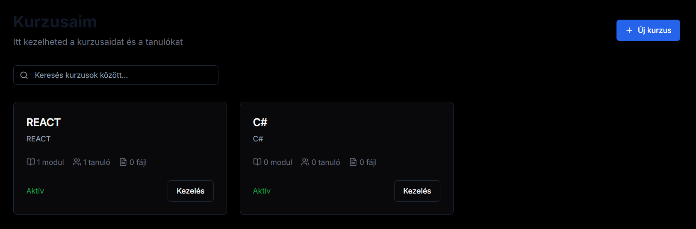
    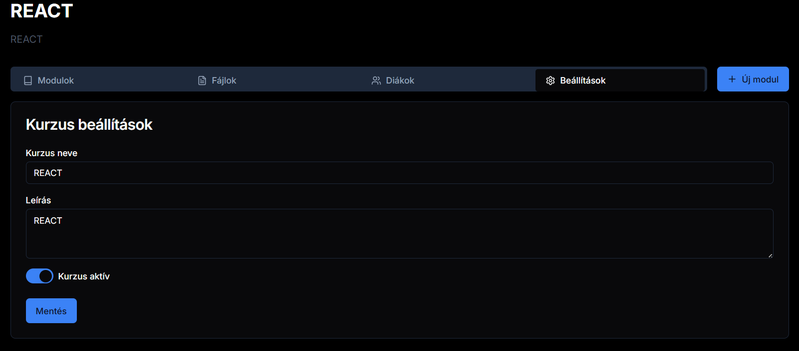
</div>


3. **Fájlok kezelése:**
   - Fájl feltöltése: Tanári oldalon a "Fájlok" gomb, majd a form kitöltése
   - Fájl törlése: Fájl oldalon a "Törlés" gomb
   - Fájl megtekintése, letöltése: Fájl oldalon a "Megtekintés" gomb, ha .zip a kiterjesztés akkor a fájl letöltésre kerül

<div style="display: flex; flex-direction: column; align-items: center; margin: 20px 0;">
    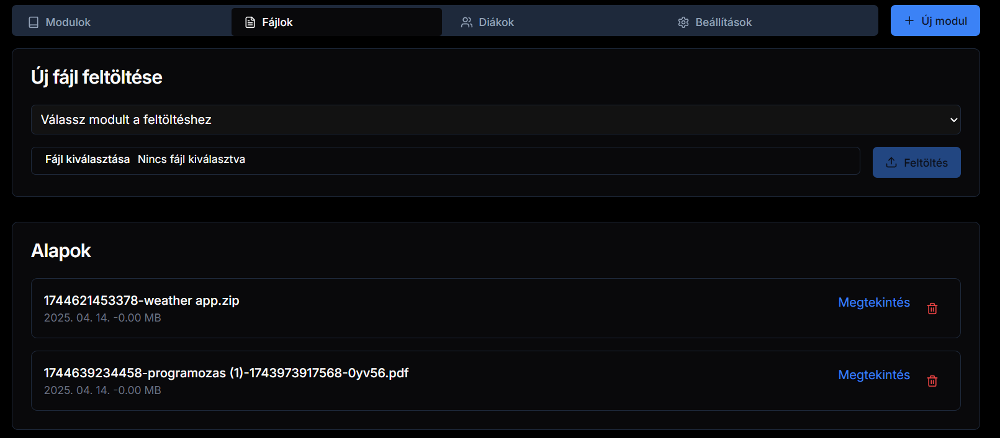
</div>


4. **Profil kezelése:**
   - Profil módosítása: FMenüsávban a névre kattintáskor a formot kell kitölteni

<div style="display: flex; flex-direction: column; align-items: center; margin: 20px 0;">
    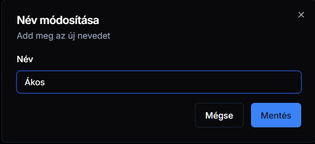
</div>

#### 9.3. Hibaelhárítás

1. **Bejelentkezési problémák:**
   - Ellenőrizze az internetkapcsolatot
   - Törölje a böngésző cache-t
   - Próbálja meg újra a bejelentkezést

2. **Fájl feltöltési problémák:**
   - Ellenőrizze a fájl méretét (max. 10MB)
   - Ellenőrizze a fájl típusát (csak engedélyezett típusok)
   - Ellenőrizze az internetkapcsolatot

3. **Adatbázis problémák:**
   - Ellenőrizze az adatbázis kapcsolatot
   - Ellenőrizze a környezeti változókat
   - Indítsa újra az adatbázis szolgáltatást

4. **Egyéb problémák:**
   - Ellenőrizze a böngésző konzolt
   - Ellenőrizze a szerver logokat
   - Lépjen kapcsolatba a támogatással

#### 9.5. Biztonsági Tippek

1. **Fiók biztonsága:**
   - Használjon erős jelszót
   - Engedélyezze a kétfaktoros azonosítást
   - Ne ossza meg a bejelentkezési adatait

2. **Adatok biztonsága:**
   - Rendszeresen készítsen biztonsági másolatot
   - Ne küldjön bizalmas adatokat emailben
   - Használjon biztonságos kapcsolatot

3. **Rendszer biztonsága:**
   - Tartsa naprakészen a szoftvert
   - Használjon vírusirtót
   - Kerülje a nyilvános hálózatokat

4. **Jogosultságok kezelése:**
   - Csak a szükséges jogosultságokat adja meg
   - Rendszeresen ellenőrizze a jogosultságokat
   - Azonnal vonja vissza a nem használt jogosultságokat

## 10. Fejlesztői Dokumentáció

### 10.1. Fejlesztői Környezet Beállítása

A fejlesztői környezet beállítása során a következő lépéseket kell elvégezni:

1. **Fejlesztői környezet telepítése:**
   - Node.js és npm telepítése
   - A projekt függőségeinek telepítése

2. **Környezeti változók beállítása:**
   - `.env fájl létrehozása és konfigurálása
   - Adatbázis kapcsolati adatok megadása
   - NextAuth.js alap URL megadása

3. **Fejlesztői környezet indítása:**
   - Adatbázis inicializálása
   - Alkalmazás indítása

### 10.2. Kódolási Konvenciók

A fejlesztői csapat által követett kódolási konvenciók:

1. **Névjegyek:**
   - Konzisztens és jól olvasható névjegyek
   - Különbséget teszünk a különböző típusú fájlok között

2. **Formázás:**
   - 4 szóköz indentálás
   - Konzisztens stílus

3. **Kommentálás:**
   - Minden függvényhez és osztályhoz dokumentációt írunk
   - A dokumentációt a függvények és osztályok felett helyezzük el

4. **Refaktorálás:**
   - A kód rendszeresen átültetése
   - A kód olvashatóságának javítása

5. **Hibakezelés:**
   - Minden hibát kezelünk
   - A hibák jól dokumentáltak

### 10.3. Verziókezelési Stratégia

A verziókezelési stratégia a következő:

1. **Verziószámozás:**
   - A verziók számozása a következő formátumban: `vX.Y.Z`
   - A `X` a főverziószám, a `Y` a kisebb frissítések száma, a `Z` pedig a hibajavítások száma

2. **Verziókövetés:**
   - A verziókövetést a Git használatával valósítjuk meg
   - Minden verzióhoz commit-ot készítünk
   - A verziókövetés a GitHubon történik

3. **Verziókövetési folyamat:**
   - A fejlesztők egy feature branch-en dolgoznak
   - A feature branch-en a fejlesztés után egy pull request-et készítenek
   - A pull request-en a code review folyamatán megy keresztül
   - A code review után a verziókövetésre kerül a master branch-re
   - A master branch-en a fejlesztés folytatódik

4. **Verziókövetési dokumentáció:**
   - A verziókövetési dokumentációt a GitHubon tároljuk
   - A verziókövetési dokumentációt a fejlesztők által folyamatosan frissítjük

## 11. Jövőbeli Tervek

### 11.1. AI Segítő Rendszer

A platformba tervezett AI integráció a következő funkciókat fogja tartalmazni:

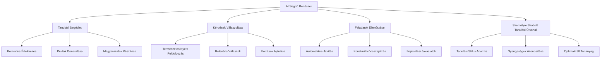

### 11.2. Pontrendszer és Versenyek

A tervezett pontrendszer és versenyrendszer a következő elemeket fogja tartalmazni:

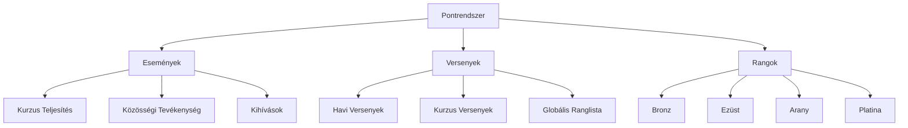

### 11.3. Chat Alkalmazás

A tervezett chat rendszer a következő funkciókat fogja tartalmazni:

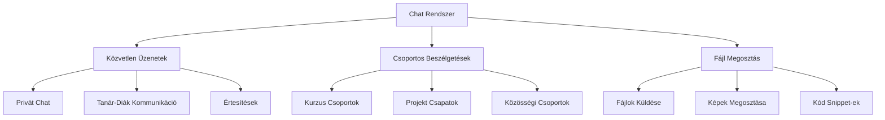

### 11.4. Képernyő Megosztás és Whiteboard

A tervezett együttműködési eszközök a következő funkciókat fogják tartalmazni:

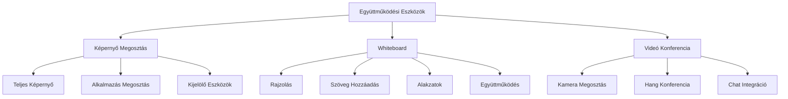

### 11.5. Implementációs Terv

A jövőbeli funkciók implementálásának tervezett idővonala:

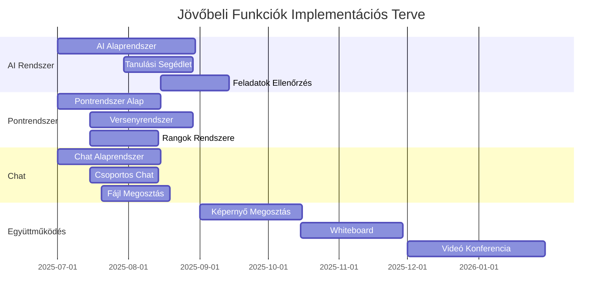

A jövőbeli tervek megvalósítása során különös figyelmet fordítunk a következőkre:
- Felhasználói élmény optimalizálása
- Teljesítmény és skálázhatóság
- Biztonság és adatvédelem
- Integráció a meglévő rendszerrel
- Folyamatos visszajelzés és finomhangolás